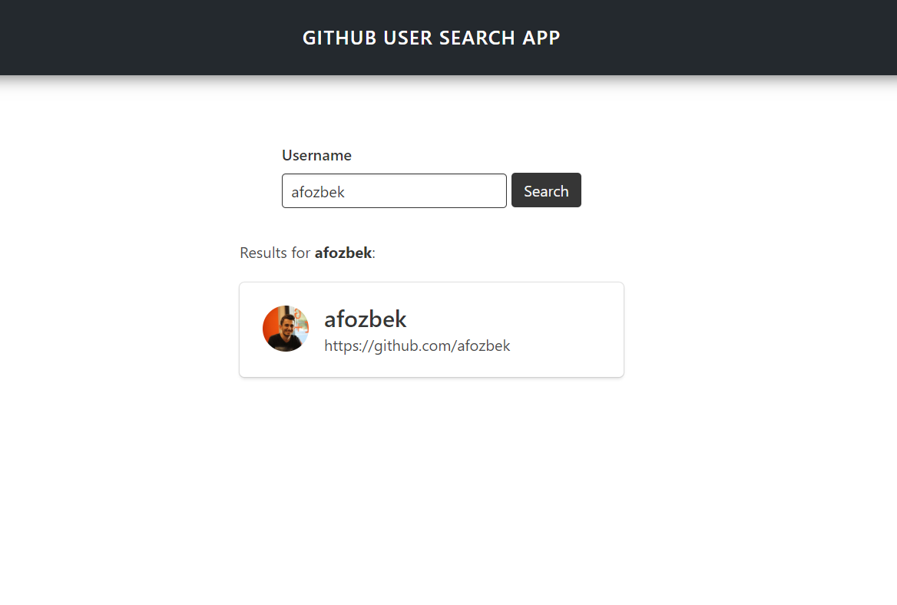

# github-profiles

Search the specific user and visit individual page for repo info

# Github Profiles

> Search the specific user and visit individual page for repo info

**Main Page '/'**

**User Page '/user/:username'**

### Installing

- run `npm install` or `yarn install` in the terminal.
- run `npm start` or `yarn start` after installation

## Deployment

You can easily deploy the project over [Netlify](https://www.netlify.com/) or `github-pages`. Check out the documentation

## Built With

- [Vue](https://vuejs.org/) - UI library for javascript
- [Vue-Router](https://router.vuejs.org/) - Routing
- [Vuex](https://vuex.vuejs.org/) - Better State Management
- [Momentjs](https://momentjs.com/) - Date library
- [Buefy](https://buefy.org/) - Bulma + Vue

## Contributing

- If you have problems please leave an `issue` from [here](https://github.com/afozbek/github-profiles/issues)
- Consider forking the project and submitting new `pull requests`. I am much likely control [my github account](https://github.com/afozbek).

## Authors

- Abdullah Furkan Özbek -> [twitter](https://twitter.com/afozbek_), [github](https://github.com/afozbek), [linkedin](https://linkedin.com/in/afozbek)

## License

This project is licensed under the MIT License - see the [LICENSE](LICENSE) file for details
